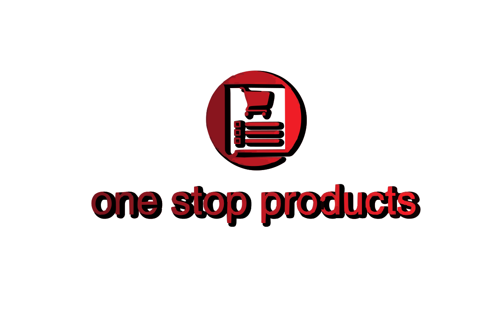

## One Stop Products Platform Frontend

Table of Contents
Overview
Features
Project Structure
Installation
Usage
Components
State Management
API Integration
Styling
Testing
Contributing
License
## Overview
Welcome to the One Stop Products Platform Frontend repository! This project is the frontend of a comprehensive e-commerce platform designed to offer users an intuitive and seamless shopping experience. Built using React, Redux Toolkit, and Styled Components, the platform is robust, scalable, and fully responsive.

## Features
1. User Authentication: Secure login and registration with JWT-based authentication.
2. Product Listing: Dynamic product catalog with search, filters, and sorting options.
3. Product Details: Detailed product pages with images, ratings, reviews, and related items.
4. Shopping Cart: Add, remove, and update product quantities with real-time price updates.
5. Wishlist: Save your favorite items for later.
6. Checkout Process: Streamlined checkout flow with payment integration.
7. Admin Dashboard: Manage products, orders, and user accounts.
8. Responsive Design: Optimized for both desktop and mobile devices.
9. SEO Friendly: Meta tags, Open Graph, and structured data implemented for better search engine visibility.

## Project Structure
OneStopShop-Frontend/
│
├── public/                 # Static assets
│   └── index.html          # HTML entry point
│
├── src/
│   ├── components/         # Reusable React components
│   ├── pages/              # Application pages (Home, ProductDetails, Cart, etc.)
│   ├── stores/             # Redux Toolkit stores for state management
│   ├── utils/              # Utility functions
│   ├── App.js              # Main app component
│   ├── index.js            # React entry point
│   └── ...                 # Other config files and assets
│
├── .env                    # Environment variables
├── package.json            # Dependencies and scripts
├── README.md               # Project documentation
└── ...                     # Other config files (ESLint, Prettier, etc.)
## Installation
To get started with the project, follow these steps:

## Clone the Repository:
1. git clone https://github.com/Rhoda-NM/OneStopShop-Frontend.git

## Navigate to the Project Directory:
2. cd OneStopShop-Frontend

## Install Dependencies:
3. Make sure you have Node.js installed, then run:
**npm install**

## Set Up Environment Variables:
4. Create a .env file in the root directory and add necessary environment variables:

    REACT_APP_API_URL=http://localhost:5000/api

## Start the Development Server:
**npm start**
This will run the app in development mode. Open http://localhost:3000 to view it in the browser.

## Usage
Running the Application
Once the development server is running, you can explore the various features of the platform:

1. Home Page: Browse the product catalog.
2. Product Details: Click on a product to view detailed information, including images, descriptions, and reviews.
3. Shopping Cart: Add products to your cart and proceed to checkout.
4. Admin Dashboard: If you have admin privileges, manage products, orders, and users from the dashboard.

## Building for Production
To create an optimized build for production, run:
**npm run build**
The build folder will contain the optimized app ready for deployment.

## Components
## Header
The Header component provides navigation links and access to the user profile and cart. It’s responsive and adapts to mobile screens.

## Footer
The Footer component contains useful links, contact information, and social media icons.

## ProductDetails
The ProductDetails component is the core of the product detail page, displaying images, ratings, reviews, and related products.

## Cart
The Cart component manages the shopping cart, allowing users to add, remove, and adjust quantities of items.

## CartPage
The CartPage component displays a detailed view of the items in the user's shopping cart, including the total price and checkout options.

## Contact
The Contact component provides users with a form to reach out to customer support or the platform's team.

## Dashboard
The Dashboard component is where admins and users can manage their profiles, orders, products, and other platform-related activities.

## ErrorPage
The ErrorPage component handles the display of error messages and redirections when users encounter issues navigating the platform.

## Footer
The Footer component contains links, contact information, and social media icons, appearing at the bottom of each page.

## Header
The Header component provides navigation links, a search bar, and access to the user profile and cart, adapting to mobile screens.

## Home
The Home component serves as the landing page, showcasing featured products, promotions, and categories.

## Modal
The Modal component is a reusable UI element for displaying pop-up dialogs, including confirmations, alerts, and other notifications.

## Products
The Products component handles the display of all products available on the platform, including filtering and sorting options.

## Profile
The Profile component allows users to view and edit their personal information, order history, and preferences.

## Search
The Search component provides a search bar and results page, allowing users to find products by keywords, categories, and other filters.

## User
The User component manages user-specific information and functionality, including login, registration, and profile settings.

## Wishlist
The Wishlist component lets users save their favorite products for future purchases.

## State Management
The project leverages Redux Toolkit to streamline state management and ensure efficient data handling across the application. Redux Toolkit simplifies Redux store configuration, reduces boilerplate code, and provides powerful tools for managing application state.

## Stores Overview
## 1.Cart
1. Purpose: Manages the state of the shopping cart, including the items added, their quantities, and total price.
## Key Actions:
1. addItem: Adds a new item to the cart or updates the quantity if the item already exists.
2. removeItem: Removes an item from the cart.
3. updateQuantity: Updates the quantity of a specific item in the cart.
4. clearCart: Clears all items from the cart.
## Selectors:
1. getCartItems: Retrieves the list of items in the cart.
2. getCartTotal: Calculates the total price of items in the cart.
3. 
## 2.Products

1. Purpose: Handles product-related data, including fetching, searching, and filtering products.
## Key Actions:
1. fetchProducts: Fetches the list of products from the backend API.
2. searchProducts: Filters products based on user input or criteria.
3. filterProducts: Applies filters (e.g., category, price range) to the product list.
## Selectors:
1. getAllProducts: Retrieves the full list of products.
getFilteredProducts: Retrieves products based on applied filters.
2. getProductById: Retrieves detailed information about a specific product.

## User
1. Purpose: Manages user authentication, profile information, and session state.
## 1.Key Actions:
1. login: Authenticates the user and stores authentication tokens.
2. logout: Logs the user out and clears session data.
updateProfile: Updates the user's profile information.
3. register: Registers a new user account.
## 2.Selectors:
1. getUserInfo: Retrieves the current user's profile information.
2. isAuthenticated: Checks if the user is authenticated.
3. getAuthToken: Retrieves the authentication token for API requests.
   
## Sample Redux Store Configuration
Here’s how the Redux store is configured using Redux Toolkit:

javascript
import { configureStore } from '@reduxjs/toolkit';
import cartReducer from './cart';
import productsReducer from './products';
import userReducer from './user';

export const store = configureStore({
  reducer: {
    cart: cartReducer,
    products: productsReducer,
    user: userReducer,
  },
});

1. cartReducer: Manages the state and actions related to the shopping cart.
2. productsReducer: Handles product data and actions for fetching, searching, and filtering.
3. userReducer: Manages user authentication and profile state.
This setup ensures that each part of the application has a dedicated slice of state, making it easier to maintain and scale the application.

## API Integration
All data is fetched from the backend API, which is built using Flask. The API endpoints include:

GET /api/products: Fetch the list of products.
GET /api/products/:id: Fetch detailed information about a specific product.
POST /api/cart: Add items to the shopping cart.
POST /api/auth/login: Authenticate users.

## Styling
The project uses Styled Components for styling React components. This approach allows for scoped and dynamic styling, ensuring that styles are only applied to the components that need them.

## Testing
Testing is an important part of the development process. The project uses Jest and React Testing Library for unit and integration tests.

## Running Tests
To run the tests, simply execute:
        **npm test**
This will run all tests and output the results in the terminal.
## Contributing
We welcome contributions to the project! If you have an idea for a feature, or if you've found a bug, feel free to open an issue or submit a pull request.

## Contributors

- **Scrum Master**: [Rhoda Muya](https://github.com/Rhoda-NM)
- **Group Members**:
  - [Mariya Mwanjiru](https://github.com/mwanjiru12)
  - [Bravin Kibet](https://github.com/Bravinkibet)
  - [Ephy Muiruri](https://github.com/Ephymuiruri)
  - [Brian Onduso](https://github.com/BrianOnduso0)
  - [Lennis Maina](https://github.com/Maichmaina)

## Contribution Guidelines
1.Fork the repository.
2.Create a new branch with your feature.
3.Commit your changes and push to your fork.
4.Submit a pull request with a detailed explanation of your changes.
## License
This project is licensed under the MIT License - see the LICENSE file for details.

